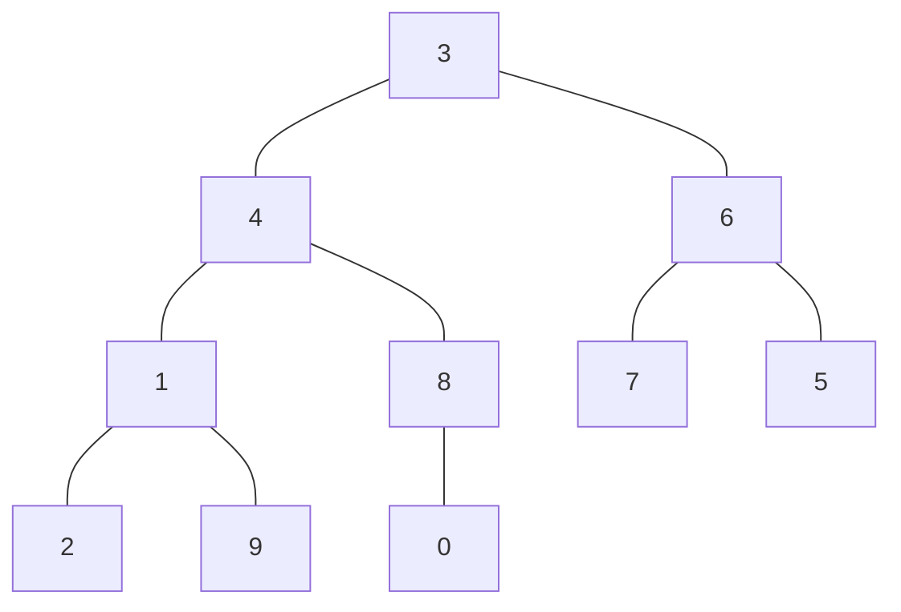

# DataStructure

## LinkedList

### 约瑟夫环

问题：N个人围成一圈，从第一个开始报数，第M个将被杀掉，最后剩下一个，其余人都将被杀掉。求剩下的这个人是谁。

分别利用线状链表（等同于数组）和环状链表实现约瑟夫环。

## Tree

### BinaryTree(二叉树)

实现二叉树的增、删、查、改功能，并利用递归实现前序、中序、后序遍历。

其中二叉树节点的删除操作需要额外注意：

首先，需要寻找删除节点是否存在，因此方法应该设置为bool类型，若存在则返回true，不存在则返回false；

然后，该节点的存在方式有三种，可分为两大类分别讨论：

1. 该节点的子节点 $\leqslant1$ ，例如：$15\rightarrow11\rightarrow13\rightarrow14$，删除11.

这种情况比较简单，用该节点的子节点替换该节点就行。此时该节点对应地址用不上，可以直接delete；

2. 该节点的子节点数 $=2$，例如：$15\rightarrow11\rightarrow10\rightarrow13\rightarrow12\rightarrow14$（前序遍历），删除11.

这种情况较为复杂，考虑到树单个节点的删除应该对树整体改动尽可能小，可以用该节点左子树的最大值（靠右下角的值），或右子树的最小值（靠左下角的值）代替该节点的值。在例中，右子树的最小值为12，故将11替换为12，并delete12，即可完成操作。

### BalancedBinaryTree(平衡二叉树)

平衡二叉树的特点是：在二叉树的基础上，通过旋转结点，使得每个结点的左右子树高度差的绝对值$\leqslant 1$.

名词介绍：

1. 节点高度：从一个结点开始向下数，直到叶子节点为止，经过的最长路径。
2. 平衡因子(BF)：对于一个结点来说，平衡因子=左子树高度-右子树高度，用于衡量树是否失衡。
3. 最小不平衡子树：距离插入结点最近的，且$|BF|\geqslant2$的结点，称为最小不平衡结点；以此结点为根节点构成的树。通过旋转操作修正最小不平衡子树后，整棵树也会平衡。

首先结合具体情况介绍两个基本旋转操作：左旋和右旋：

1. 右旋（顺时针旋转）


如图，这时插入结点3，树变为


显然，对于结点10来说，$BF\geqslant2$，树失衡。此时，将7作为根节点，10及其右子树作为7的右子树，8及其子树作为10的左子树，树变为：


$BF=0$，树重新平衡。

2. 左旋（逆时针旋转）

   ```mermaid
   graph TB
   10 --- 7
   10 --- 15
   15 --- 13
   15 --- 17
   ```

   插入结点20，树变为

   ```mermaid
   graph TB
   10 --- 7
   10 --- 15
   15 --- 13
   15 --- 17
   17 --- 20
   ```

   显然，对于结点10来说，$BF\leqslant-2$，树失衡。此时，将15作为根节点，10及其左子树作为15的左子树，13及其子树作为10的右子树，树变为：

   ```mermaid
   graph TB
   15 --- 10
   15 --- 17
   17 --- 20
   10 --- 7
   10 --- 13
   ```

   此时$BF=0$，树重新平衡。

根据插入结点（下面用insert表示）相对于最小不平衡结点（下面用root表示）的不同位置，可分为4种情况：

1. LL(insert插入在root的左子树上，且在叶子结点的左孩子上)
   举例：上面的右旋例子，解决方法也是通过一次右旋操作完成。
2. RR(insert插入在root的右子树上，且在叶子结点的右孩子上)
   举例：上面的左旋例子，解决方法也是通过一次左旋操作完成。
3. LR(insert插入在root左孩子的右子树上)

   解决方法：将root的左孩子左旋，变为LL，再将整棵树右旋
   举例：

   ```mermaid
   graph TB
   10 --- 5
   10 --- 15
   5 --- 4
   5 --- 7
   ```

   在这棵树中插入6或者9，这里以9为例

   ```mermaid
   graph TB
   10 --- 5
   10 --- 15
   5 --- 4
   5 --- 7
   7 --- 9
   ```

   首先，将10的左子树左旋，树变为：

   ```mermaid
   graph TB
   10 --- 7
   10 --- 15
   7 --- 5
   7 --- 9
   5 --- 4
   ```

   此时树变为LL的情况，将其右旋

   ```mermaid
   graph TB
   7 --- 5
   7 --- 10
   5 --- 4
   10 --- 9
   10 --- 15
   ```
4. RL(insert插入在root右孩子的左子树上)

   解决方法：将root的右孩子右旋，再将整棵树左旋

   举例：

   ```mermaid
   graph TB
   10 --- 7
   10 --- 15
   15 --- 13
   15 --- 17
   ```

   插入11或14，这里以11为例：

   ```mermaid
   graph TB
   10 --- 7
   10 --- 15
   15 --- 13
   15 --- 17
   13 --- 11
   ```

   首先将10的右孩子右旋，得到：

   ```mermaid
   graph TB
   10 --- 7
   10 --- 13
   13 --- 11
   13 --- 15
   15 --- 17
   ```

   此时树变为RR情况，将整棵树左旋：

   ```mermaid
   graph TB
   13 --- 10
   10 --- 7
   10 --- 11
   13 --- 15
   15 --- 17
   ```

### HuffmanTree(哈夫曼树)

构建树的过程：

1. 将给定数组按从大到小排序，改为节点后即为树的叶子节点。用栈存储所有叶子节点，
2. 拿出栈中最小的两个节点，用两者之和作为双亲节点，值较小的作为左节点，值较大的作为右节点，构成一颗树，将双亲节点存入栈中，排序；
3. 重复2步骤，直到栈中只剩下最后一个节点，即为根节点。

由于操作常常需要排序，故对栈进行改进，当数据push进栈时，直接将其插入对应的位置，而不是插入至栈顶。

编码过程：

1. 创建数组，用于存储code值，该数组容量需要大于树的深度，
2. 将左侧节点赋0，右侧节点赋1，递归操作整棵树，
3. 当达到叶子节点时，打印code值，返回。

## Sort(例：3, 4, 6, 1, 8, 7, 5, 2, 9, 0)

### InsertSort(直接插入排序)

将第$i$个数插入到前$i-1$个数组成的有序数列中。

例中，将1插入到3,4,6中：比较1和6的大小，发现$1<6$，交换1和6的顺序；

然后比较1和4的大小，发现$1<4$，交换1和4的位置；

然后比较1和3的大小，发现$1<3$，交换1和3的位置，此时1，3，4，6组成的数列有序。

### ShellSort(希尔排序，缩小增量排序)

1. 设置初始步长step（一般设置为 length//2）；
2. 将数组中每隔step个数组成的数组归为一组，分别对其进行插入排序；
3. 将step=step//2，重复2，3操作直到step<1.

例中step=length//2=5，因此归类为{3, 7}, {4, 5}, {6, 2}, {1, 9}, {8, 0}，分别对其进行插入排序，整体数组变为:

{3, 4, 2, 1, 0, 7, 5, 6, 9, 8};

然后step=5//2=2，归类为{3, 2, 0, 5, 9}, {4, 1, 7, 6, 8}，分别进行插入排序，整体数组变为：

{0, 1, 2, 4, 3, 6, 5, 7, 9, 8};

然后step=2//2=1，进行插入排序，整体数组有序；

最后step=1//2=0，退出循环。

### QuickSort（快速排序）

1. 设置分界值（一般设置为第一个数），设置i，j下标，分别为数组最低位和最高位（以下分别用i，j代替i，j下标对应的值）；
2. j 从右向左寻找比i小的数，若找到，或 j 坐标 < i 坐标，则将 j 赋给 i ；
3. i 从左向右寻找比j大的数，若找到，或 i 坐标 > j 坐标，则将 i 赋给 j ；
4. 重复2，3操作，直到 i 坐标> j 坐标相遇，将分界值赋给i；
5. 递归操作分界值左边的数列和右边的数列，当数列长度为1时递归条件终止。

例中分界值为3，i对应3，j对应0，0<3，将 j 赋给 i ，i 为0；i向右寻找，找到 4>0，将 i 赋给 j ，j=4，此时数列为：

{0, 4, 6, 1, 8, 7, 5, 2, 9, 4}；

j向左寻找，找到 2<4, 将 j 赋给 i，i为2；i向右寻找，找到 6>2，将 i 赋给 j，j=6，此时数列为：

{0, 2, 6, 1, 8, 7, 5, 6, 9, 4}；

j向左寻找，找到 1<6, 将 j 赋给 i，i为1；i向右寻找，i>j，将 i 赋给 j，j=1，跳出循环，此时数列为：

{0, 2, 1, 1, 8, 7, 5, 6, 9, 4}；

i坐标>j坐标，跳出大循环，将分界值赋给 i ，i=3，此时数列为：

{0, 2, 1, 3, 8, 7, 5, 6, 9, 4}；

递归操作3左边的数列和3右边的数列。

### HeapSort（堆排序）

1. 什么是堆

   首先，堆是一颗用数组存储的完全二叉树，且每个节点的值一定大于（或小于）其两个子节点的值。若大于，则称为大顶堆，小于称为小顶堆。将数组从小到大排序用大顶堆，从大到小用小顶堆。
2. 与二叉搜索树的区别

   堆只要求节点的值大于（或小于）子节点的值，二叉搜索树要求左节点<父节点<右节点。
3. 完全二叉树的一些性质

   下标为i的节点的父节点下标:$(i - 1) // 2$

   下标为i的节点的左孩子下标:$i * 2 + 1$

   下标为i的节点的右孩子下标:$i * 2 + 2$

首先介绍如何对堆的指定节点进行维护，以大顶堆为例：

1. 找出该节点、左节点和右节点中的最大值，将最大节点与当前节点交换顺序；
2. 将交换顺序后的节点当作当前节点，向下递归维护。

然后介绍排序方法：

1. 建堆，从最后一个有子节点的节点开始向前维护，这个节点的坐标为：$(n-1)//2$；
2. 排序，将根节点与最后一个节点交换顺序，因为堆的根节点为堆中最大值，所以交换后最后一个节点最大，即有序；然后对根节点进行维护，长度去除有序的节点；
3. 重复排序操作，直到数组完全有序。

举例：3, 4, 6, 1, 8, 7, 5, 2, 9, 0

将其构建成一颗完全二叉树：



建堆：

n=10, (n-1)//2 = 4，所以从8开始建堆。8不用维护。

向前找到1，9>1，将9与1交换，维护完毕。

向前找到6，7>6，将7与6交换，维护完毕。

向前找到4，9>4，将9与4交换，维护完毕。

向前找到3，9>3，将9与3交换，对3进行维护，8>3，将8与3交换，维护完毕。

建成的堆为：9, 8, 7, 4, 3, 6, 5, 2, 1, 0

排序：

将9与0交换顺序，对堆 0, 8, 7, 4, 3, 6, 5, 2, 1进行维护，得到数组 8, 4, 7, 2, 3, 6, 5, 0, 1, 9.

将8与1交换顺序，对堆 1, 4, 7, 2, 3, 6, 5, 0进行维护，得到数组 7, 4, 6, 2, 3, 1, 5, 0, 8, 9.

将7与0交换顺序，对堆 0, 4, 6, 2, 3, 1, 5进行维护，得到数组 6, 4, 5, 2, 3, 1, 0, 7, 8, 9.

将6与0交换顺序，对堆 0, 4, 5, 2, 3, 1进行维护，得到数组 5, 4, 1, 2, 3, 0, 6, 7, 8, 9.

将5与0交换顺序，对堆 0, 4, 1, 2, 3进行维护，得到数组 4, 3, 1, 2, 0, 5, 6, 7, 8, 9.

将4与0交换顺序，对堆 0, 3, 1, 2进行维护，得到数组 3, 2, 1, 0, 4, 5, 6, 7, 8, 9.

将3与0交换顺序，对堆 0, 2, 1进行维护，得到数组 2, 0, 1, 3, 4, 5, 6, 7, 8, 9.

将2与1交换顺序，对堆 2, 0进行维护，得到数组 1, 0, 2, 3, 4, 5, 6, 7, 8, 9.

将1与0交换顺序，得出结果。

### 时间复杂度的空间复杂度

| 排序方法     | 平均时间复杂度   | 空间复杂度 |
| ------------ | ---------------- | ---------- |
| 直接插入排序 | $O(n^2)$       | $O(1)$   |
| 希尔排序     | $O(n^{1.3})$   | $O(1)$   |
| 快速排序     | $O(nlog_{2}n)$ | $O(n^2)$ |
| 堆排序       | $O(nlog_2n)$   | $O(1)$   |
